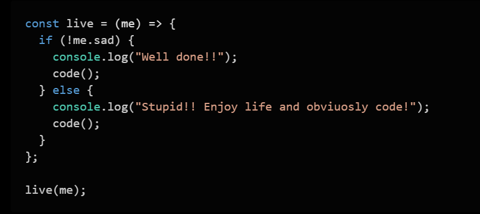

<h2 align="center">My skillset</h2>

|                                                                                                                                                                                                                                                                                                                                                                                                                                               Expert                                                                                                                                                                                                                                                                                                                                                                                                                                                |                                                                                                                                                                                                                                          Improve                                                                                                                                                                                                                                          |                                                                                                                   Learn                                                                                                                   |
| :-------------------------------------------------------------------------------------------------------------------------------------------------------------------------------------------------------------------------------------------------------------------------------------------------------------------------------------------------------------------------------------------------------------------------------------------------------------------------------------------------------------------------------------------------------------------------------------------------------------------------------------------------------------------------------------------------------------------------------------------------------------------------------------------------------------------------------------------------------------------------------------------------: | :---------------------------------------------------------------------------------------------------------------------------------------------------------------------------------------------------------------------------------------------------------------------------------------------------------------------------------------------------------------------------------------------------------------------------------------------------------------------------------------: | :---------------------------------------------------------------------------------------------------------------------------------------------------------------------------------------------------------------------------------------: |
|          |      |     |

<h2 align="center">About me</h2>
<table align="center">
    <thead>
        <th>Daily routine</th>
        <th>Hobbies</th>
    </thead>
    <tbody>
        <tr>
            <td rowspan="7" width="600px"></td>
            <td>⚽ Football</td>
        </tr>     
        <tr>
            <td>🎿 Ski</td>
        </tr>     
        <tr>
            <td>🏃‍♂️ Running</td>
        </tr>     
        <tr>
            <td>⛰️ Trekking</td>
        </tr>        
        <tr>
            <td>🏊‍♂️ Swimming</td>
        </tr>        
        <tr>
            <td>🏍️ Riding</td>
        </tr>        
        <tr>
            <td>🏟️ AC Milan</td>
        </tr>        
    </tbody>
</table>

<h2 align="center">Social</h2>
    <table align="center">
        <thead>
            <th>Reach me out</th>
            <th>Github profile visitors count</th>
        </thead>
        <tbody>
            <tr>
                <td>
                
                
                
                
                
                
                
                
                </td>
                <td>
                    
                </td>
            </tr>        
        </tbody>
    </table>

<!--
**ivan-pesenti/ivan-pesenti** is a ✨ _special_ ✨ repository because its `README.md` (this file) appears on your GitHub profile.

Here are some ideas to get you started:

- 🔭 I’m currently working on ...
- 🌱 I’m currently learning ...
- 👯 I’m looking to collaborate on ...
- 🤔 I’m looking for help with ...
- 💬 Ask me about ...
- 📫 How to reach me: ...
- 😄 Pronouns: ...
- ⚡ Fun fact: ...
-->
